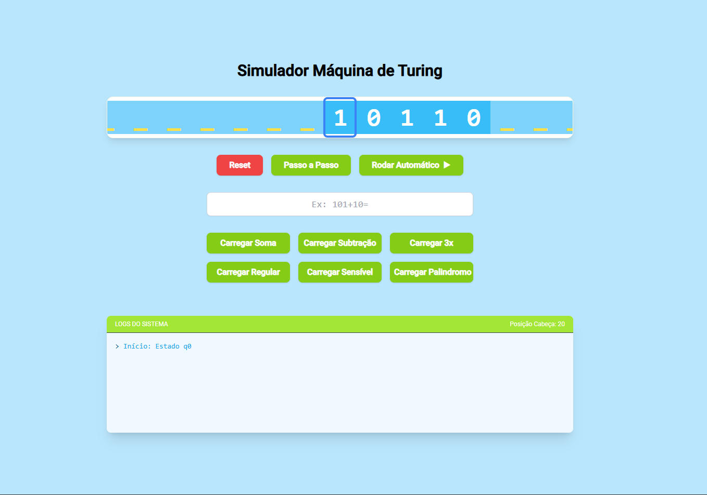
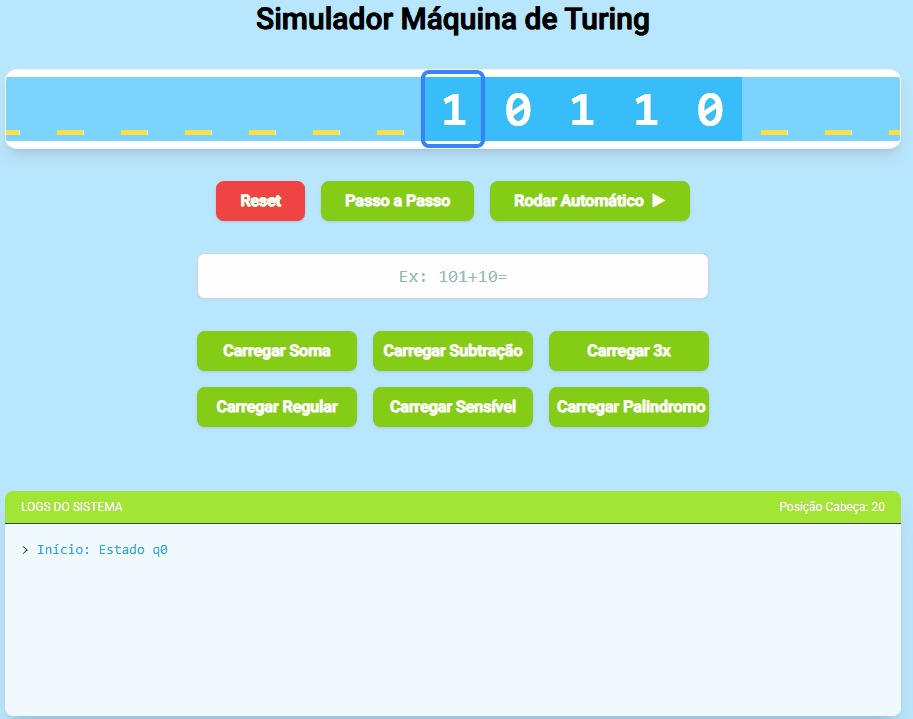
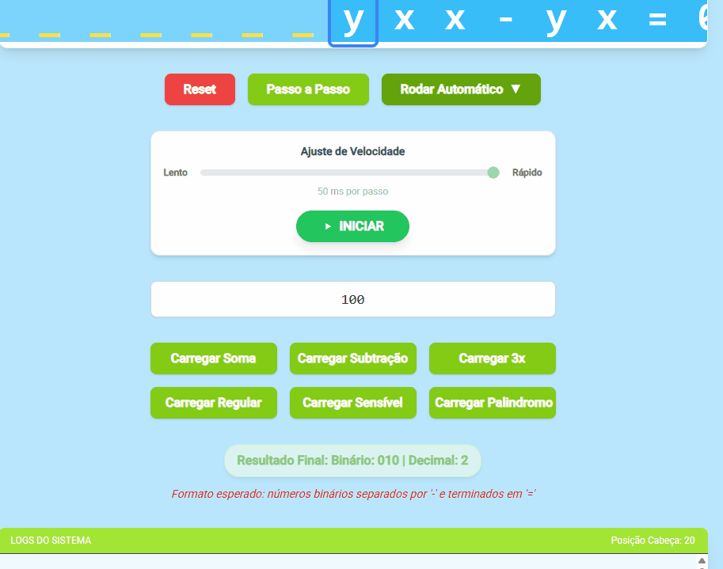
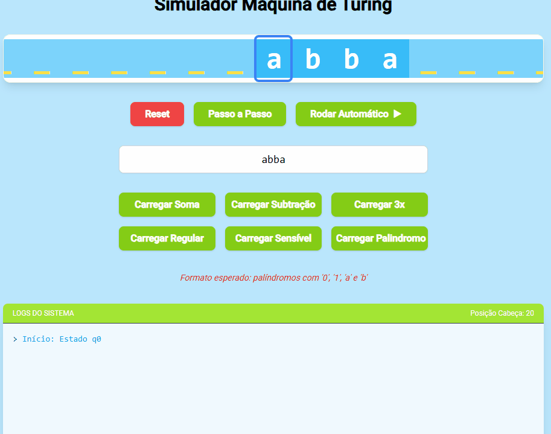

# Simulador de Máquina de Turing

Este projeto é um simulador gráfico de Máquina de Turing desenvolvido em **Angular** e estilizado com **TailwindCSS** para cadeira de Teoria da computação.  
Ele permite visualizar a fita, movimentação da cabeça de leitura, execução passo a passo e execução automática com ajuste de velocidade.

---



---

## Funcionalidades

- Visualização da fita da Máquina de Turing com animação.
- Exibição da posição atual da cabeça de leitura.
- Execução:
  - Passo a passo
  - Automática (com controle de velocidade)
- Reset da máquina
- Logs detalhados da execução
- Carregamento de diferentes máquinas:
  - Soma binária
  - Subtração binária
  - Multiplos de 3
  - Linguagem regular (a^s b^n)
  - Linguagem sensível ao contexto (aⁿ bⁿ cⁿ)
  - Verificador de palíndromos
- Campo para inserir entrada personalizada conforme a máquina escolhida.

---

## Tecnologias Utilizadas

- **Angular 17+**
- **TailwindCSS**
- **TypeScript**
- **Node.js / npm**
- **Material Icons**

---

## Como Executar

```bash
npm install
```
```bash
ng serve
```
---
## Funcionalidades
---
### Soma


---
### Subtração


---
### Identificar multiplo de 3


---
### Identificar linguagem Regular


---
### Identificar linguagem Sensível


---
### Identificar Palindromo


---


